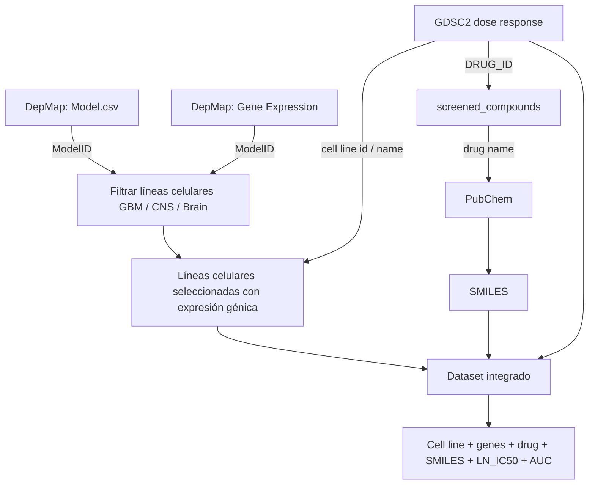

# Dataset Reference

Referencia rápida para entender qué es cada archivo en `data/raw/`.

---

## Estructura

```text
data/
└── raw/
    ├── depmap/
    │   ├── Model.csv
    │   └── OmicsExpressionTPMLogp1HumanProteinCodingGenes.csv
    │
    └── cellmodelpassports/
        ├── GDSC2_fitted_dose_response_27Oct23.csv
        └── screened_compounds_rel_8.5.csv
```

---

## 1. DepMap

### `Model.csv`

**Qué es:**
Tabla de metadatos de las líneas celulares.

**Qué representa una fila:**
Una línea celular.

**Para qué sirve:**
Sirve para saber qué tipo de cáncer es cada línea celular y de qué tejido viene.

**Ejemplo mental:**

```text
ModelID → nombre de línea celular → tipo de cáncer → tejido
```

**Uso principal:**

```text
filtrar líneas celulares de glioblastoma / brain / CNS
```

---

### `OmicsExpressionTPMLogp1HumanProteinCodingGenes.csv`

**Qué es:**
Matriz de expresión génica.

**Qué representa una fila:**
Una línea celular.

**Qué representa una columna:**
Un gen.

**Qué representa un valor:**
Qué tan activo está ese gen en esa línea celular.

**Ejemplo mental:**

```text
ModelID       GeneA   GeneB   GeneC
ACH-000001    2.1     0.0     7.8
ACH-000002    5.4     1.2     3.9
```

**Uso principal:**

```text
representar biológicamente cada línea celular como un vector numérico
```

## 2. Cell Model Passports / GDSC

### `GDSC2_fitted_dose_response_27Oct23.csv`

**Qué es:**
Tabla de sensibilidad a fármacos.

**Qué representa una fila:**
Un experimento entre una línea celular y un fármaco.

```text
línea celular X + droga Y → respuesta medida
```

**Columnas importantes:**

```text
LN_IC50
AUC
DRUG_ID
CELL_LINE_NAME / identifiers
```

**LN_IC50:**

```text
más bajo = la droga es más potente
más alto = la célula es más resistente
```

**AUC:**

```text
más bajo = más sensible
más alto = más resistente
```

**Uso principal:**

```text
saber qué tan bien funciona una droga contra una línea celular
```

---

### `screened_compounds_rel_8.5.csv`

**Qué es:**
Diccionario de fármacos.

**Qué representa una fila:**
Un fármaco.

**Para qué sirve:**
Traduce el ID interno de GDSC al nombre del compuesto.

**Ejemplo mental:**

```text
DRUG_ID → drug_name
```

**Uso principal:**

```text
unir GDSC2 con nombres reales de drogas
```

Luego el nombre de la droga puede usarse para buscar SMILES en PubChem.


## 3. PubChem

**Qué es:**
Fuente externa para obtener información química de las drogas.

**Input:**

```text
drug_name
```

**Output esperado:**

```text
SMILES
```

**SMILES:**
Representación textual de una molécula.

**Uso principal:**

```text
convertir una droga en features químicas
```

Ejemplo:

```text
drug_name → PubChem → SMILES → fingerprint / embedding
```

---

## 4. Cómo se une todo



## 6. Resumen

```text
Model.csv
→ dice qué es cada línea celular

OmicsExpression...
→ dice qué genes están activos en cada línea celular

GDSC2_fitted_dose_response...
→ dice cómo responde cada línea celular a cada droga

screened_compounds...
→ traduce DRUG_ID a nombre de droga

PubChem
→ traduce nombre de droga a SMILES
```

---

## 7. Regla mental

```text
DepMap describe la célula.
GDSC describe la respuesta a drogas.
screened_compounds traduce el ID de la droga.
PubChem describe químicamente la droga.
```